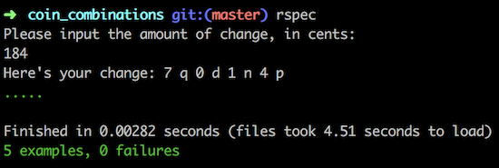

# numbers_to_words

## GitHub repository: https://github.com/r-craig73/coin_combinations

#### By Ron Craig (https://github.com/r-craig73) & David Lewis

## Description
#### An Epicodus lesson 02/07/2018: Create a script that lets a user enter an amount of cents and shows the smallest number of quarters, dimes, nickels, and pennies needed to make that change.

#### Coin Combinations Case Specs
1. The method returns pennies when a user values less than 4 cents
  * input: coin = Counter.new(4)
  * output: expect(coin.coin_calculator).to(eq("0 q 0 d 0 n 4 p"))
2. The method returns a nickel when a user inputs 5 cents
  * input: coin = Counter.new(5)
  * output: expect(coin.coin_calculator).to(eq('0 q 0 d 1 n 0 p'))
3. The method returns a nickel and penny(ies) when a user input values between 6 and 9 cents
  * input: coin = Counter.new(7)
  * output: expect(coin.coin_calculator).to(eq('0 q 0 d 1 n 2 p'))
4. The method returns a dime, nickel(s) and penny(ies) when a user input values between 10 and 24 cents
  * input: coin = Counter.new(17)
  * output: expect(coin.coin_calculator).to(eq('0 q 1 d 1 n 2 p'))
5. The method returns a quarter, dime(s), nickel(s) and penny(ies) when a user input values between 25 and 49 cents
  * input = Counter.new(42)
  * output: expect(coin.coin_calculator).to(eq('1 q 1 d 1 n 2 p'))

### Rspec results

## Setup/Installation Requirements
### Clone repository.
### Install Ruby and Gems
* `$ gem install rspec`
* `$ gem install pry`
* `$ bundle install`

### Run rspec in the terminal's home directory path
* `numbers_to_words $ rspec`

## Technologies Used
* Ruby
* Ruby script
* Ruby Gems

## Support and contact details
_Please contact ron.craig@comcast.net with questions._

## MIT License